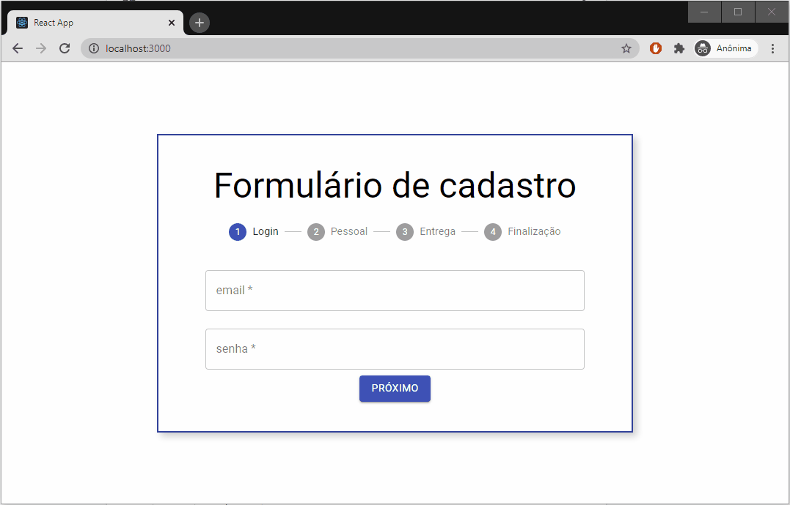

### Formulario de cadastro com ReactJS e MaterialUI

Aplicando conceitos intermédiarios sobre o React como useContext, Hooks customizados, useEffect e padrões de projeto

<h4 align="center">
    
</h4>

This project was bootstrapped with [Create React App](https://github.com/facebook/create-react-app).

## Itens estudados

- Usando Material UI
- Functions Components
- Hooks { useState e useEffect }
- Formatações especificas de inputs forms
- Renderização condicional
- Padrão Model Viewer e regras de negócio (validações)
- Injeção de dependência e Create/Use Contexts + Providers
- Padronização de projetos usando práticas de SOLID e CleanCode
- Hooks customizados

### `yarn start`

Open [http://localhost:3000](http://localhost:3000) to view it in the browser.
